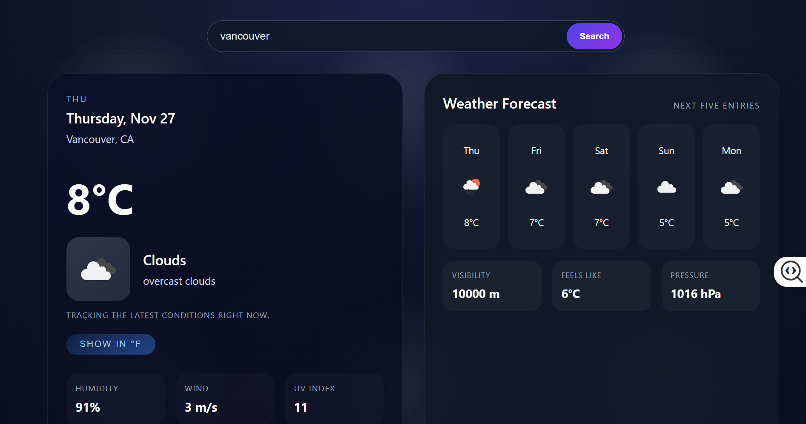

# Weather Dashboard

## Screenshots

### Home screen



!(public/screenshots/screenshot1.png)


## Project Description

- **Reference layout**: The hero card and forecast card mirror the provided mockups, including the rounded cards, neon typography, and layered cloudy background in `src/App.css` and `src/index.css`.
- **Live OpenWeatherMap data**: The app fetches `/weather` for the hero section and `/forecast` for the next five entries, deduplicating the results by weekday so that each card corresponds to a distinct day.
- **User controls & accessibility**: Users search for cities, toggle between metric and imperial units (the toggle exposes `aria-pressed`), and receive status messaging for loading/errors.

## Setup Steps

1. Install dependencies:

   ```bash
   npm install
   ```

2. Provide your OpenWeatherMap API key in a `.env.local` or `.env` file at the project root:

   ```env
   REACT_APP_OPENWEATHER_KEY=your_real_key_here
   ```

3. Start the development server:

   ```bash
   npm start
   ```

4. (Optional) Build for production to double-check everything compiles:

   ```bash
   npm run build
   ```

## API Used

- `https://api.openweathermap.org/data/2.5/weather`: Supplies the current temperature, feels-like value, humidity, wind speed, condition, and icon used in the hero card and stats.
- `https://api.openweathermap.org/data/2.5/forecast`: Provides the upcoming entries that are deduplicated by localized weekday names before rendering the forecast cards.
- Both endpoints respect the selected unit (metric or imperial), so toggling the button re-fetches both responses to keep labels and numbers coherent.

## Notes

- Forecast entries reuse the localized weekday label to avoid duplicate day cards, even though the `/forecast` endpoint returns three-hour snapshots.
- When the forecast data lacks an icon, the hero card’s current weather icon is used as a fallback so the layout remains consistent.
- Drop `hero-preview.png` and `forecast-preview.png` into the `README_images` folder so they render at the top of this document (create the folder if it is missing).
